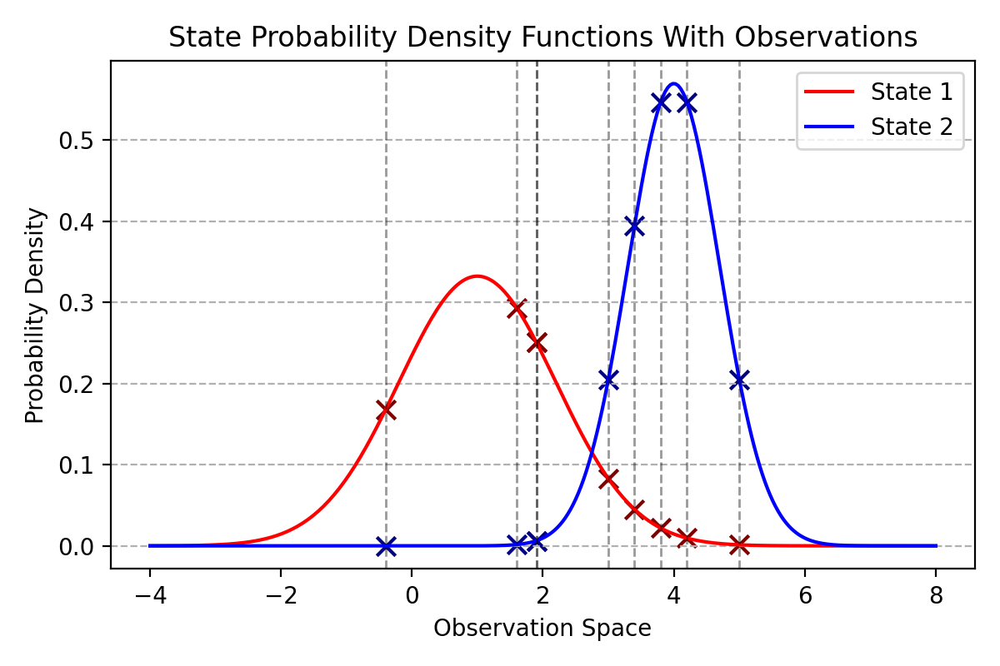
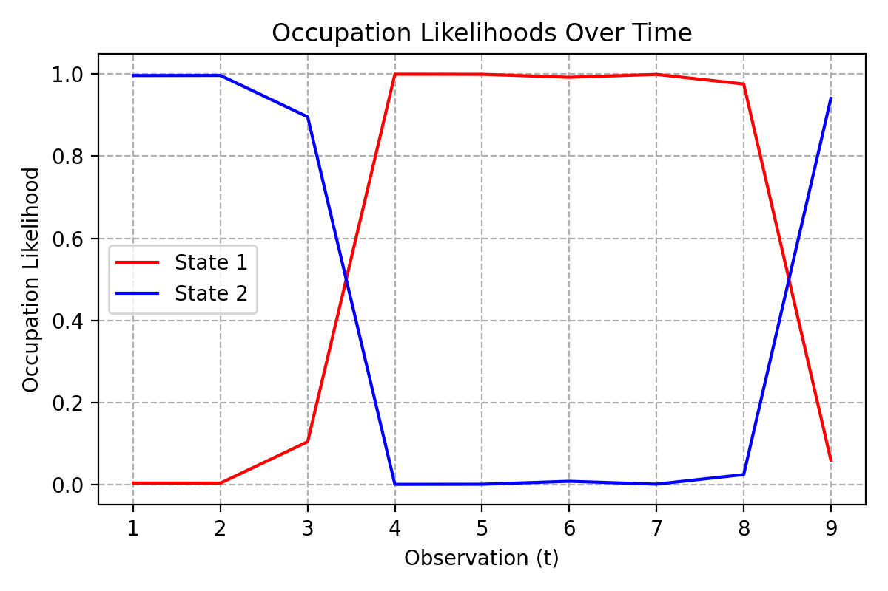
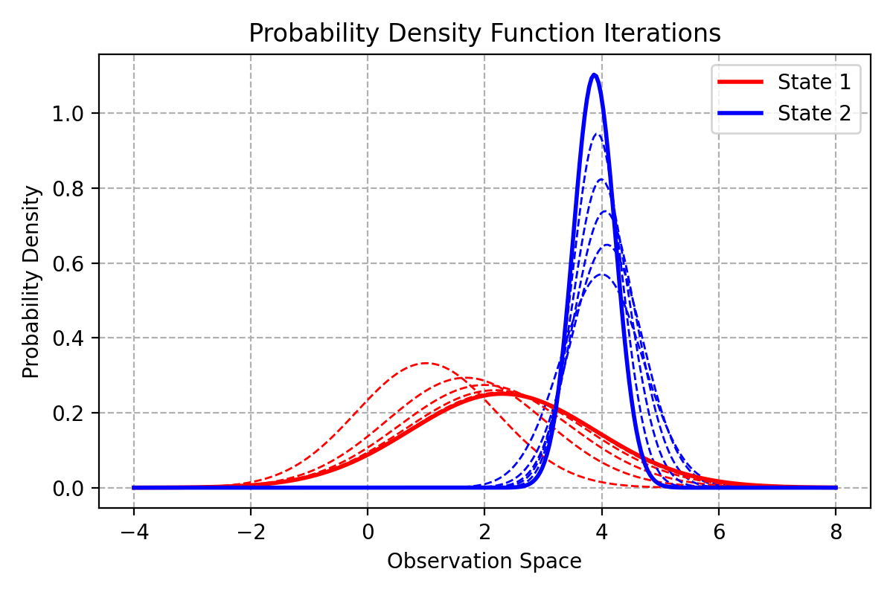

Hidden Markov Models
====================

Speech recognition coursework focusing on training and  analysing hidden markov models.

Probability density functions with provided observations marked

Occupation likelihoods for each state through time

Output Gaussian functions through 5 iterations of Baum-Welch training